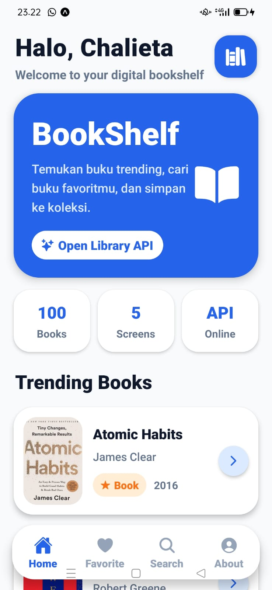
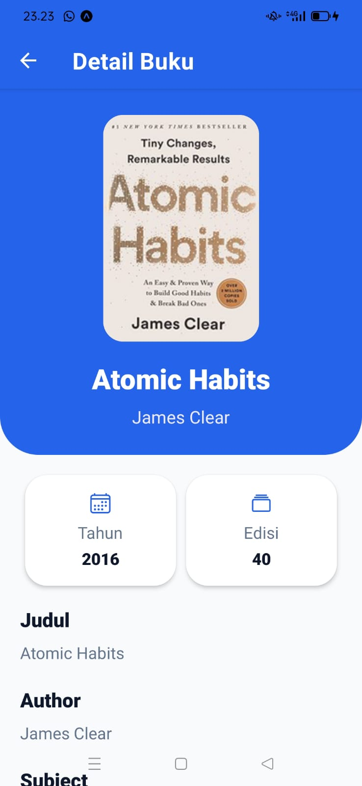
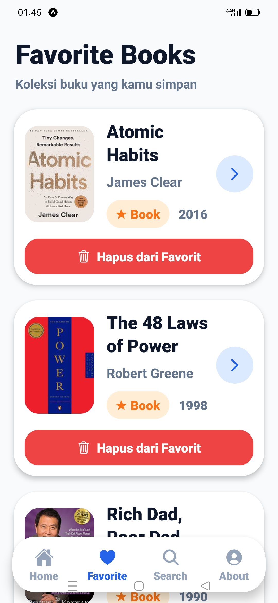
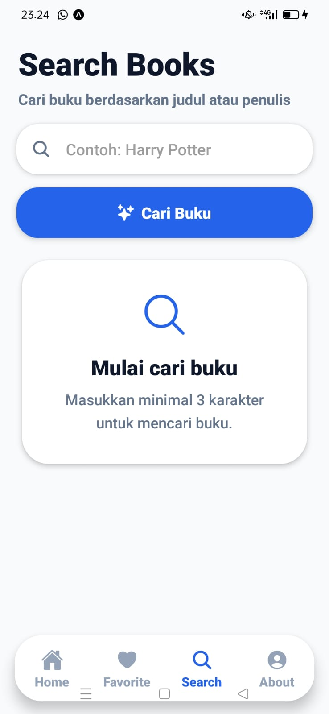
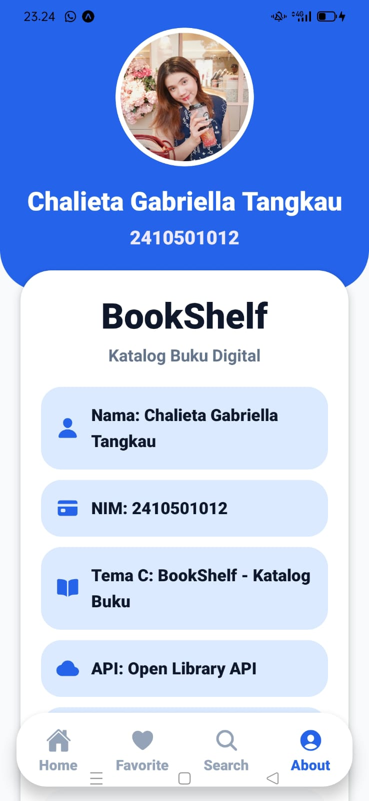

# BookShelf - Katalog Buku Digital
Nama: Chalieta Gabriella Tangkau
NIM: 2410501012
Kelas: B

# Tema Project
Tema C: BookShelf - Katalog Buku
Aplikasi mobile sederhana berbasis React Native + Expo yang menampilkan katalog buku dari Open Library API, dilengkapi fitur pencarian, detail buku, dan favorit.

# Tech Stack
   1. React Native (Expo SDK)
   2. React Navigation (Stack + Bottom Tabs)
   3. Context API + useReducer (State Management)
   4. Fetch API (Data Fetching)
   5. Open Library API

Contoh versi 

"react": "...",
"react-native": "...",
"expo": "...",
"@react-navigation/native": "...",

# Cara Install & Run
   1. Clone repository:
git clone https://github.com/chalietagabriella-design/uts-mobile-lanjut-2410501012-chalieta-gabriella-tangkau.git
   2. Masuk ke folder project:
cd bookshelf-chalieta
   3. Install dependencies:
npm install
   4. Jalankan aplikasi:
npx expo start
   5. Scan QR dengan Expo Go (Android/iOS)

# Screenshot Aplikasi
### Home Screen

### Detail Screen

### Favorite Screen

### Search Screen

### About Screen

# Video Demo
Link Youtube video demo : https://youtu.be/VSgCEEvxQJw?si=t0nG4-ddJ2Q7z42p
Link Google Drive video demo : https://drive.google.com/file/d/1-2OIJ11P2SQV6nNAKnloBsACgAPXkqUt/view?usp=drivesdk

# State Management
Aplikasi ini menggunakan Context API + useReducer untuk mengelola state favorit.

   1. Alasan memilih:
Lebih sederhana dibanding Redux
Cocok untuk aplikasi skala kecil-menengah
Tidak perlu install library tambahan
Mudah dipahami dan diimplementasikan
   2. Kelebihan:
Ringan dan built-in dari React
Struktur state lebih terorganisir
Cocok untuk fitur favorit
   3. Kekurangan:
Kurang optimal untuk aplikasi besar
Debugging tidak selengkap Redux

# Referensi
https://docs.expo.dev/
https://reactnavigation.org/
https://openlibrary.org/developers/api
https://react.dev/reference/react/useReducer
https://stackoverflow.com/
https://www.youtube.com/

# Refleksi Pengerjaan
Selama pengerjaan aplikasi BookShelf ini, saya mengalami beberapa kesulitan terutama dalam pengambilan data dari Open Library API. Data yang diberikan oleh API tidak selalu lengkap, seperti tidak adanya cover buku, nama author, atau deskripsi. Untuk mengatasi hal tersebut, saya menambahkan pengecekan kondisi dan memberikan nilai default seperti "Tidak tersedia" atau menampilkan placeholder.

Selain itu, saya juga mengalami bug pada bagian navigasi dan state management, terutama saat mengirim data antar screen dan mengelola data favorit. Masalah ini dapat diatasi dengan memahami penggunaan navigation params dan implementasi Context API dengan useReducer.

Saya juga belajar bagaimana menangani error saat jaringan tidak tersedia dengan menampilkan pesan error dan menghapus data lama agar tidak membingungkan pengguna. Implementasi loading indicator dan pull-to-refresh juga memberikan pengalaman pengguna yang lebih baik.

Dari project ini, saya memahami lebih dalam tentang React Native, penggunaan API eksternal, serta bagaimana membuat aplikasi mobile dengan struktur yang rapi dan fitur yang lengkap. Project ini juga melatih saya dalam debugging dan memahami alur data dalam aplikasi mobile.

# Credit
Dibuat oleh Chalieta Gabriella Tangkau (2410501012)